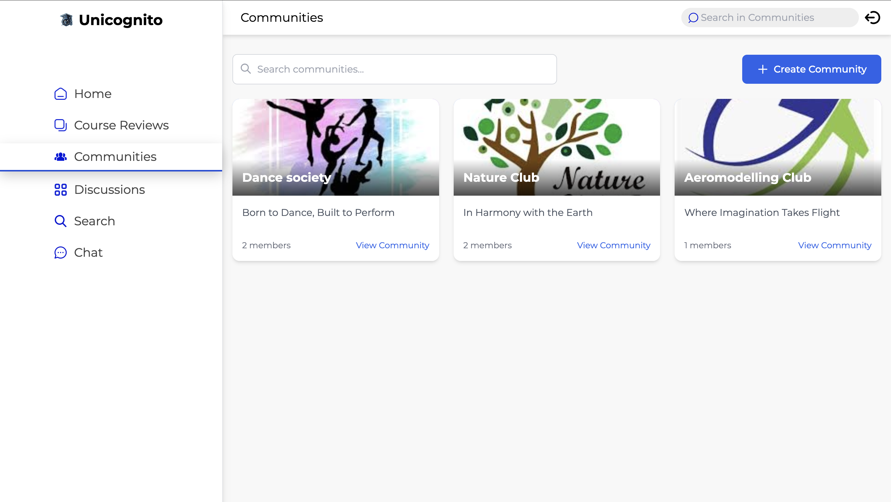
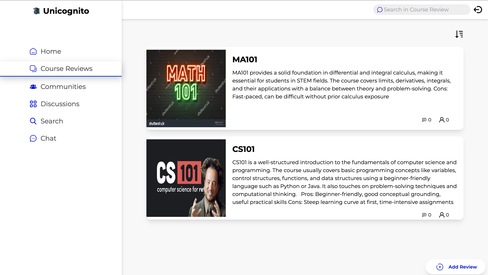
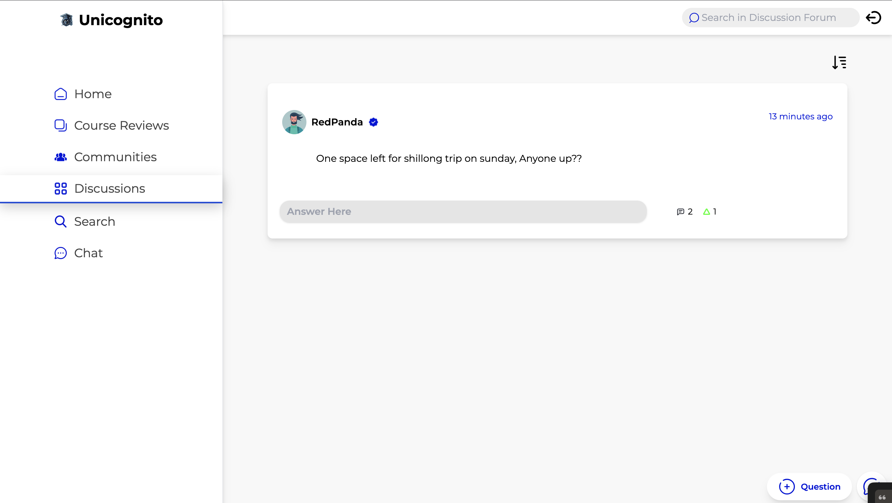
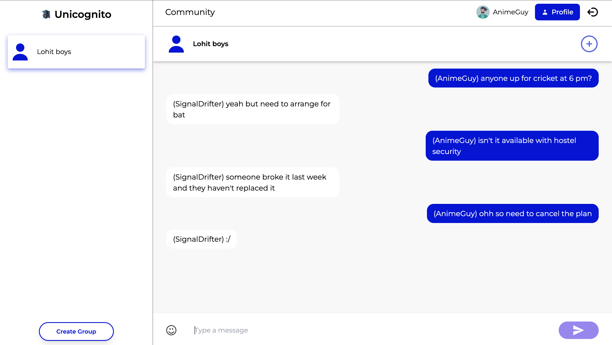

# Unicognito

Unicognito is a comprehensive social platform designed for university communities, offering features like discussion forums, course reviews, communities, group chats, and personalized feeds.

## Features

- **Discussion Forums**: Ask questions, share knowledge, and engage in academic discussions
- **Communities**: Create and join communities based on interests, courses, or clubs
- **Course Reviews**: Read and write reviews for university courses
- **Group Chat**: Real-time messaging with peers in group conversations
- **Personalized Feed**: Stay updated with posts from your network and communities

## UI Showcase

### Feed


### Communities


### Course Reviews


### Discussion Forums


### Group Chat


## Tech Stack

- **Frontend**: React.js, Tailwind CSS
- **Backend**: Node.js, Express.js
- **Database**: MongoDB
- **Authentication**: JSON Web Tokens (JWT)
- **File Storage**: Local storage & Cloudinary integration

## Getting Started

### Prerequisites
- Node.js (v14 or higher)
- MongoDB

### Installation

1. Clone the repository:
   ```
   git clone https://github.com/yourusername/unicognito.git
   cd unicognito
   ```

2. Install server dependencies:
   ```
   cd server
   npm install
   ```

3. Install client dependencies:
   ```
   cd ../client
   npm install
   ```

4. Set up environment variables:
   - Create a `.env` file in the server directory
   - Add the necessary environment variables (see `.env.example` if available)

5. Start the development server:
   ```
   # In the server directory
   npm run dev

   # In the client directory (in another terminal)
   npm start
   ```

6. Open your browser and navigate to `http://localhost:3000`
